# 🙌 Bienvenidos al archivo de ayuda de SoundSeeker

Este documento tiene como objetivo proporcionar una guía completa para desarrolladores y usuarios técnicos interesados
en comprender, instalar y operar SoundSeeker. Encontrarás información detallada sobre la arquitectura de la aplicación,
cómo montar y ejecutar el proyecto localmente usando Docker, y las configuraciones necesarias para personalizar la
aplicación a tu entorno y necesidades.

Te invitamos a leer detenidamente cada sección para asegurar una implementación exitosa y sacar el máximo provecho a las
funcionalidades de SoundSeeker.

¡Un abrazo musical y hasta la próxima sinfonía de código! 🎻🎹🎼

* [📋 Aspectos Técnicos](#-aspectos-técnicos)
    * [Arquitectura](#arquitectura)
    * [Flujo de Despliegue](#flujo-de-despliegue)
* [🚀 Instalación](#-instalación)
    * [Requisitos de Software](#requisitos-de-software)
    * [Configuración de Variables de Entorno](#configuración-de-variables-de-entorno)
    * [Inicialización del Proyecto](#inicialización-del-proyecto)
    * [Verificación](#verificación)
    * [Detener y Limpiar](#detener-y-limpiar)
* [✨ Variables de Entorno](#-variables-de-entorno)
    * [Plantilla](#plantilla)
    * [Explicación de Variables](#explicación-de-variables)
    * [Ejemplo de Servidores en `.env` para Producción](#ejemplo-de-servidores-en-env-para-producción)

## 📋 Aspectos Técnicos

### Arquitectura

El proyecto implementa una arquitectura de microservicios donde el Front-end y el Back-end funcionan de manera
independiente, pero se comunican entre sí a través de una API REST. A continuación se detallan los componentes:

- **Front-end**: Desarrollado en React.js y desplegado en un servidor Nginx que sirve el contenido estático y actúa como
  proxy reverso para las solicitudes al Back-end.
- **Back-end**: Desarrollado con Spring Boot y empacado como un JAR ejecutable, se despliega en un entorno Java
  proporcionado por Amazon Corretto. El Back-end gestiona las operaciones de la base de datos y envía correos
  electrónicos a través de un servidor SMTP.
- **Base de datos**: Se utiliza MySQL como sistema de gestión de base de datos para almacenar y recuperar la información
  necesaria para el funcionamiento de la aplicación.

### Flujo de Despliegue

1. **Construcción del Back-end**: Utilizando Gradle y JDK 17 en un contenedor de Docker, se compila el código fuente de
   Spring Boot y se genera un `app.jar`, almacenado en un caché de Docker.
2. **Inicialización de la Base de Datos**: Se levanta un contenedor de MySQL, donde se crea la base de
   datos `soundseeker`.
3. **Ejecución del Back-end**: Una vez Gradle y MySQL están listos, se copia `app.jar` del caché a un contenedor basado
   en Amazon Corretto 17 Alpine y se ejecuta, llenando la base de datos a través de Hibernate.
4. **Construcción del Front-end**: Se crea un contenedor con Node 20 Alpine para compilar la aplicación React para
   producción.
5. **Servidor Nginx**: Con el Front-end completo, se configura un contenedor de Nginx utilizando archivos `.conf` del
   repositorio para establecer el servidor y el proxy reverso, y se sirven los archivos estáticos de React.

El diagrama de flujo de contenedores Docker a continuación ilustra cómo los distintos contenedores son creados y se
relacionan entre sí durante el proceso de ejecución del comando `docker compose up`.

```mermaid
stateDiagram-v2
    state "docker compose up" as DCU
    state "Desde Gradle 8.3 JDK17" as GBC
    state "app.jar" as JAR
    state "Gradle Cache Volume" as GCV
    state "Desde MySQL Latest" as DBC
    state "Base de datos SoundSeeker" as SDB
    state "Desde Amazon Corretto 17" as AMZ
    state "app.jar desde Gradle Cache Volume" as SBA
    state "Base de datos SoundSeeker" as SBD
    state "Desde Node 20" as NDJ
    state "React App para Producción" as RBD
    state "Desde Nginx Stable" as NGI
    state "Servidor y Proxy Inverso" as SPI
    state "Archivos estáticos" as SSF
    state fork <<fork>>
    state join <<join>>

    state services {
        [*] --> fork
        fork --> gradle_build
        fork --> db
        gradle_build --> join
        db --> join
        join --> back: con gradle_build completo y db saludable
        back --> front: con back ejecutándose
        front --> [*]

        state gradle_build {
            [*] --> GBC
            GBC --> JAR: compila y produce
            JAR --> GCV: guarda datos en
            GCV --> [*]
        }
        state db {
            [*] --> DBC
            DBC --> SDB: inicializa
            SDB --> [*]
        }
        state back {
            [*] --> AMZ
            AMZ --> SBA: copia y ejecuta
            SBA --> SBD: inyecta datos a
            SBD --> [*]
        }
        state front {
            [*] --> node
            node --> nginx: copia

            state node {
                [*] --> NDJ
                NDJ --> RBD: construye
                RBD --> [*]
            }
            state nginx {
                [*] --> NGI
                NGI --> SPI: configura
                SPI --> SSF: sirve
                SSF --> [*]
            }
        }
    }

    [*] --> DCU
    DCU --> services: crea
    services --> [*]: sirve peticiones
```



## 🚀 Instalación

### Requisitos de Software

Antes de comenzar, asegúrate de tener instalado [Docker Engine](https://docs.docker.com/engine/install/)
y [Docker Compose](https://docs.docker.com/compose/install/). Para sistemas operativos Windows y
Mac, [Docker Desktop](https://www.docker.com/products/docker-desktop/) incluye ambos y es la opción recomendada.

### Configuración de Variables de Entorno

El proyecto utiliza un archivo `.env` para manejar la configuración de las variables de entorno. Para configurar el
entorno de manera adecuada, sigue estos pasos:

1. En la raíz del proyecto, crea un archivo `.env` utilizando el ejemplo proporcionado en la sección
   de [✨ Variables de Entorno](#-variables-de-entorno).
2. Edita las variables con tus propios valores.

### Inicialización del Proyecto

Con Docker instalado y el archivo `.env` configurado, estás listo para inicializar y ejecutar la aplicación, para ello,
posiciónate en el directorio raíz del proyecto, abre una terminal y ejecuta el siguiente comando:

```bash
docker compose up
```

Este comando descargará las imágenes necesarias, construirá el proyecto y lo pondrá en marcha. Una vez que todos los
servicios estén en funcionamiento, puedes acceder a la aplicación a través de tu navegador web
en `http://localhost:3000` o la URL configurada en tus variables de entorno.

### Verificación

Para asegurarte de que todos los servicios estén funcionando correctamente, puedes verificar el estado de los
contenedores de Docker utilizando:

```bash
docker ps
```

Esto te permitirá ver todos los contenedores que están corriendo, junto con su estado y puertos expuestos.

### Detener y Limpiar

Para detener la aplicación y limpiar los contenedores y redes creados, puedes ejecutar el siguiente comando:

```bash
docker compose down
```

Esto detendrá todos los contenedores y eliminará los recursos creados durante la ejecución de `docker compose up`, sin
embargo, no eliminará las imágenes descargadas y construidas, y tampoco eliminará los volúmenes de datos. Si deseas
eliminar estos recursos, puedes ejecutar el siguiente comando:

```bash
docker compose down --rmi all --volumes
```

Lo único que no se eliminará con este comando es el caché de construcción de `buildx`, si deseas eliminarlo también,
puedes ejecutar el siguiente comando:

```bash
docker buildx prune -af
```

Queda a tu elección si deseas mantener o eliminar estos recursos, dependiendo de si planeas volver a ejecutar la
aplicación o si necesitas liberar espacio en tu sistema.

## ✨ Variables de Entorno

Las variables de entorno son esenciales para configurar diversos aspectos de la aplicación, incluyendo conexiones a
bases de datos y servicios externos. Estas variables permiten personalizar la configuración sin necesidad de alterar el
código fuente, facilitando las implementaciones en diferentes entornos, como desarrollo, pruebas y producción.

### Plantilla

Para configurar estas variables, crea un archivo `.env` en el directorio raíz del proyecto con el contenido que se
muestra a continuación, asegurándote de reemplazar los valores de ejemplo por tus propias configuraciones:

```dotenv
# Base de Datos
DB_PASSWORD=TuContrasenaPersonalizada

# Java Mail
JAVAMAIL_CORREO=tu.correo@gmail.com
JAVAMAIL_CONTRASENA=TuContrasenaDeAplicacionDeGmail

# Variables de Servidor y Despliegue
URL_SERVIDOR=http://localhost:3000
URL_SERVIDOR_S3=http://localhost:3000
AWS=http://localhost:3000

# Variables de Front-end
VITE_APP_BACK_END_URL=http://localhost:3000/api/v1
VITE_APP_IMAGE_URL=http://localhost:3000
VITE_APP_SERVER_URL=http://localhost:3000
```

### Explicación de Variables

- `DB_PASSWORD`: Esta es la contraseña para el usuario de la base de datos MySQL, por ser un contenedor de Docker, se
  utiliza una contraseña simple para propósitos de desarrollo. En un entorno de producción, debes establecer una
  contraseña segura y compleja.
- `JAVAMAIL_CORREO` y `JAVAMAIL_CONTRASENA`: Estas variables se utilizan para configurar el servicio de envío de correos
  electrónicos, permitiendo al Back-end enviar notificaciones a través de un correo electrónico de Gmail. Asegúrate de
  que `JAVAMAIL_CONTRASENA` sea una contraseña de aplicación generada para tu cuenta, puedes obtenerla siguiendo las
  instrucciones de [este enlace](https://support.google.com/accounts/answer/185833?hl=es).
- `URL_SERVIDOR`: Aquí se define la URL base del servidor donde está desplegado el Back-end de la aplicación. En
  desarrollo local, se utiliza `http://localhost:3000`, pero esto debería cambiarse a la dirección IP o dominio
  apropiado en un entorno de producción.
- `URL_SERVIDOR_S3`: Esta es la URL para acceder a tu almacenamiento en S3, donde se guardarán los archivos como
  imágenes y otros recursos. Debes reemplazar el valor de ejemplo con la URL de tu bucket de S3. Para este proyecto, no
  se utiliza un servicio de almacenamiento en la nube, por lo que se mantiene la URL base del servidor.
- `AWS`: Anteriormente, se utilizaba para definir la URL del Front-end cuando estaba desplegado en AWS. Si continúas
  desplegando el Front-end en un servicio de AWS como S3, actualiza esta variable con la URL de tu sitio web S3, de lo
  contrario, puedes dejarla como está.
- `VITE_APP_BACK_END_URL`: La URL utilizada por el Front-end para realizar solicitudes HTTP al Back-end a través del
  proxy reverso configurado en Nginx. En un entorno de producción, debes establecer esto a la URL donde se encuentra tu
  Back-end.
- `VITE_APP_IMAGE_URL`: Define la URL base para el acceso a las imágenes y otros recursos estáticos. Si estás utilizando
  un CDN o un servicio de S3 para alojar tus imágenes, establece esta variable a la URL correspondiente.
- `VITE_APP_SERVER_URL`: La URL base del servidor de la aplicación en la que se encuentra desplegado el Front-end del
  proyecto, este se utiliza para crear los enlaces para compartir.

### Ejemplo de Servidores en `.env` para Producción

A continuación, se muestra un ejemplo de cómo podrían configurarse estas variables para un entorno de producción,
reemplazando las direcciones IP y dominios ficticios por los datos reales de tu implementación:

```dotenv
# Variables de Servidor y Despliegue
URL_SERVIDOR=http://123.456.789.101:8080
URL_SERVIDOR_S3=https://my-app-images.s3.amazonaws.com
AWS=http://myapp.example.com

# Variables de Front-end
VITE_APP_BACK_END_URL=http://123.456.789.101:8080/api/v1
VITE_APP_IMAGE_URL=https://my-cdn.example.com
VITE_APP_SERVER_URL=http://myapp.example.com
```